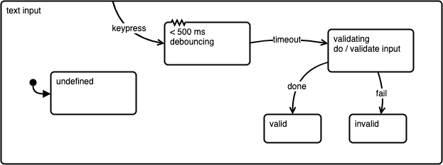

# Diagrams.net Harel Statechart Library

This is a Harel statechart library for diagrams.net (draw.io).

The shapes are based on the [original Harel statechart paper](https://www.sciencedirect.com/science/article/pii/0167642387900359).

# Online installation

You can install this library on the online diagrams.net (formerly known as draw.io) using the following link:

[Install this library on diagrams.net](https://app.diagrams.net/?splash=0&clibs=Uhttps%3A%2F%2Fraw.githubusercontent.com%2Fsamihult%2Fdrawio-statechart-lib%2Fmain%2FStatecharts.xml)

# Desktop installation

Download the file [Statecharts.xml](https://raw.githubusercontent.com/samihult/drawio-statechart-lib/main/Statecharts.xml) to a comfortable directory. Then, in the desktop application, choose from the "File" menu "Open library...".

# Examples

These diagrams are drawn using this library.

### Simple

This statechart models the behaviour of a simple door with no lock.

### Orthogonal regions

This statechart models the behaviour of a two simple doors, left and right.

### Nested state

This statechart models the behaviour of a simple door with a simple mechanical lock. 

### Final state

This statechart is an FSM that corresponds to a regular expression `ab*c`.

### Transient state

This statechart has a transient state. The dashed line is just a visual cue –
the (complementary) "always" transitions make it transient. 

### Junction

This statechart has a junction. It's a utility translating to a number of actual 
transitions. If `i` number of lines lead to a junction and `j` number of lines lead 
out of it, as a result, `i * j` transitions will be defined. In this case, the junction
has `1` input and `4` outputs, resulting in `1 * 4 = 4` actual transitions.

Junctions can help keeping the drawing clear, but they are prone to combinatorial
explosion – consider using intermediate states (perhaps transient ones) to keep the
implementation manageable.

### Timer

This statechart has a timer state. After the set time it will automatically emit an
event or take a transition – details are implementation specific.

Here the timer state is used to debounce keyboard input so that validation (that might
be an expensive operation) is only triggered while there have not been new keyboard events
in half a second.

### Revision marks and table

Revision marks and tables come from the discipline of construction engineering, where often 
complex drawings can be difficult to compare, and changes between revisions must be spotted
with ease.

Any significant small changes are marked with an arrow. Markers are given the label of
current revision, "A", "B", "C" etc. A summary of the changes is written on a new row in
the revision table.

Larger revisions are marked with suitable closed line, most often a so-called "revision cloud",
and the perimeter is marked with a label.

This is not part of any statechart functionality, but rather a meta-markup to make following
(and implementing) changes easier.  

